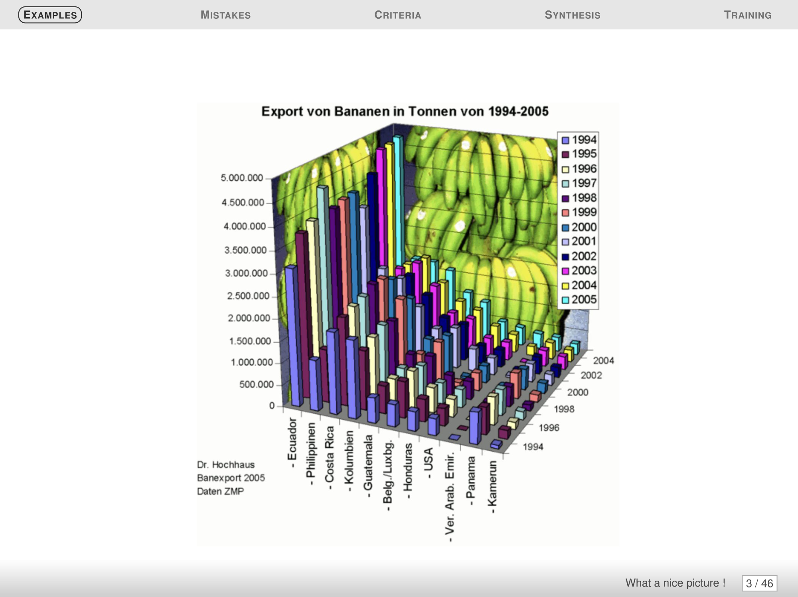

# Criticize pictures

## Bananas

### Good graphics checklist

#### Data
- [ ] Type of graphic adapted
- [ ] Interpolation make sens
- [x] Sufficient number of points
- [ ] Building method clear
- [ ] Confidence intervals visualized
- [ ] Appropriate steps for histograms
- [ ] Histograms visualize probabilities

#### Graphical objects
- [ ] Graphical objects are readable on any support
- [ ] Standard color range
- [ ] Axis identified and labelled
- [ ] Scales units are explicit
- [ ] No ambiguity when curves cross
- [ ] Grid helps reading

#### Annotation
- [ ] Axis are labelled by quantities
- [ ] Labels of the axis are clear, and self contained
- [ ] Units are indicated on the axis
- [ ] Axes are oriented fron bottom-left to top-right
- [ ] Origin should be (0,0), if not it should be clearly justified
- [ ] No Hole on the axes
- [ ] the order's of graph/histogram bar is based on classical ordering 
- [ ] Curves and Bar has legend

#### Information
- [x] Curves on the same scale
- [ ] Less than 6 curves
- [x] Compare curves on same graphics
- [ ] A curve cannot be removed without reducing infos
- [ ] The graphic gives relevant infos
- [ ] If showing average, don't forger the error bars
- [ ] It is not possible to remove object without altering readability

#### Context
- [x] All symbols used are defined and references
- [ ] The graphics is the most appropriate representation for the data
- [x] The graphic has a title
- [ ] The title is meaningful and self contained
- [ ] The graphic is referenced in text
- [ ] The text comment the figure

### Summary

Basically this figure uses non standard colors (banana image at the back), is hard to read (3D), has unexplicit and doubled scales (color and scale for years). It has no units, the origin is unclear as well as the axis.

## Gun deaths

### Good graphics checklist

#### Data
- [x] Type of graphic adapted
- [x] Interpolation make sens
- [x] Sufficient number of points
- [x] Building method clear
- [ ] Confidence intervals visualized
- [ ] Appropriate steps for histograms
- [ ] Histograms visualize probabilities

#### Graphical objects
- [x] Graphical objects are readable on any support
- [x] Standard color range
- [x] Axis identified and labelled
- [ ] Scales units are explicit
- [ ] No ambiguity when curves cross
- [ ] Grid helps reading

#### Annotation
- [x] Axis are labelled by quantities
- [x] Labels of the axis are clear, and self contained
- [x] Units are indicated on the axis
- [ ] Axes are oriented fron bottom-left to top-right
- [ ] Origin should be (0,0), if not it should be clearly justified
- [ ] No Hole on the axes
- [ ] the order's of graph/histogram bar is based on classical ordering 
- [ ] Curves and Bar has legend

#### Information
- [x] Curves on the same scale
- [x] Less than 6 curves
- [x] Compare curves on same graphics
- [x] A curve cannot be removed without reducing infos
- [x] The graphic gives relevant infos
- [ ] If showing average, don't forger the error bars
- [ ] It is not possible to remove object without altering readability

#### Context
- [x] All symbols used are defined and references
- [ ] The graphics is the most appropriate representation for the data
- [x] The graphic has a title
- [x] The title is meaningful and self contained
- [ ] The graphic is referenced in text
- [ ] The text comment the figure

### Summary

The bad point of this figure is that its scale is confusing. It is inversed and, because opf that, the evolution appeards as reversed at first sight. So the meaning of the curve is confusing as each increse is in fact a decrease and vice versa.

## Temperatures

### Good graphics checklist

#### Data
- [ ] Type of graphic adapted
- [ ] Interpolation make sens
- [x] Sufficient number of points
- [ ] Building method clear
- [ ] Confidence intervals visualized
- [ ] Appropriate steps for histograms
- [ ] Histograms visualize probabilities

#### Graphical objects
- [ ] Graphical objects are readable on any support
- [x] Standard color range
- [x] Axis identified and labelled
- [x] Scales units are explicit
- [ ] No ambiguity when curves cross
- [ ] Grid helps reading

#### Annotation
- [x] Axis are labelled by quantities
- [x] Labels of the axis are clear, and self contained
- [x] Units are indicated on the axis
- [ ] Axes are oriented fron bottom-left to top-right
- [ ] Origin should be (0,0), if not it should be clearly justified
- [ ] No Hole on the axes
- [ ] the order's of graph/histogram bar is based on classical ordering 
- [ ] Curves and Bar has legend

#### Information
- [x] Curves on the same scale
- [ ] Less than 6 curves
- [x] Compare curves on same graphics
- [ ] A curve cannot be removed without reducing infos
- [x] The graphic gives relevant infos
- [ ] If showing average, don't forger the error bars
- [ ] It is not possible to remove object without altering readability

#### Context
- [ ] All symbols used are defined and references
- [ ] The graphics is the most appropriate representation for the data
- [x] The graphic has a title
- [x] The title is meaningful and self contained
- [ ] The graphic is referenced in text
- [ ] The text comment the figure

### Summary

This figure has too much information in it, making its readability very bad on a lot fo supports. It has also a uncommon shape and we don't really know where too look. The scale is confusing as it is graphically unlinked with the data and therefore hard to understand. However, i personnally like the fact that it looks like two level of reading (near to get all informations and far to just get the evolution years by years).